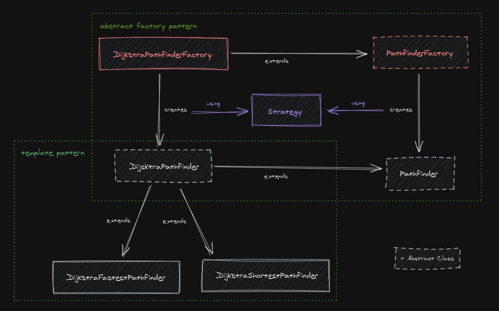

Project that aims to find the best path between two cities using an 
  architecture based on microservices using Spring Cloud and Docker.

This document is divided into 5 sections:
- _1 Usage_. Instructions about how to make it work.
- _2 Services included_. Detailed list of microservices that compose this application.
- _3 Frameworks and libraries_. Detailed list of the frameworks and libraries used by
  this application.
- _4 How it works_. Explanation of the key concepts of the project.
- _5 Other considerations_. Aspects of the project that don't fit in other sections.

## 1 Usage

The usage of this application requires Java and Docker.

### 1.1 Build it

We can skip this section directly running the script
  [buildIt.sh](https://github.com/gesteban/itinerary-challenge/blob/master/buildIt.sh), continuing
  with the _1.2 Launch it_ section.

First we have to build the application, running the Gradle tasks to clean and assemble.
From the root folder of the project, we can run this:

    ./gradlew clean build

Or we can replace `clean` with `assemble`to skip testing.

Having built the project now we need to assemble the docker images. We are going to
  also Gradle for this task. In order to create all the images we need to run the
  following commands:

    cd admin-service
    ./gradlew bootBuildImage --imageName=challenge/admin
    cd ..
    cd config-service
    ./gradlew bootBuildImage --imageName=challenge/config
    cd ..
    cd gateway-service
    ./gradlew bootBuildImage --imageName=challenge/gateway
    cd ..
    cd itinerary-service
    ./gradlew bootBuildImage --imageName=challenge/itinerary
    cd ..
    cd registry-service
    ./gradlew bootBuildImage --imageName=challenge/registry
    cd ..
    cd search-service
    ./gradlew bootBuildImage --imageName=challenge/search
    cd ..
    cd uaa
    docker build --tag challenge/uaa .
    cd ..

### 1.2 Launch it

Now we can simply run Docker Compose to start all the microservices. There's no
  need to start containers ordered, they will eventually sync with each other.

    docker-compose up

Once the services start running, they will start to establish relations between them;
  most of them retrieve its configuration from Config Server; and they also need to
  register into Eureka Server. Depending on the hosting computer, the synchronization
  process may take a few minutes.

### 1.3 Try it

To test the application go to <http://localhost:8080/swagger-ui/>. In this URL we can 
  find all the provided API call documented and ready to try out. 

The first time try to access this URL (or the API services deployed), the browser will
  redirect us to the authentication service, which will ask for our credentials and
  give us permission to use some services within our application.

To authenticate ourselves we can use the user and password stored in the authentication
  server database, which are `user1` and `password`.

Once logged, there are two API to be used (we can change between them using an input 
  located at the top-right of the webpage):

- `/api/itinerary/`. API that provides a simple listing of the itineraries inside the
  database. It also allows CRUD operations.
- `/api/search/`. Main API of the application. Provides a searching feature to look for
  different kinds of paths using the itineraries retrieved from `/api/itinerary/`.

Swagger UI defines some examples to be used that return some results, but feel free
  to try some other inputs. The database is initially loaded using
  [data.sql](https://github.com/gesteban/itinerary-challenge/blob/master/itinerary-service/src/main/resources/data.sql),
  this data can be modified before building the project or altered in running time using
  the CRUD operations of the `/api/itinerary/` service.

There is also a Spring Admin Server deployed at <http://localhost:8763/applications>, 
  which we can use to check the status of our microservices.

## 2 Services included

### 2.1 registry-service

Eureka Server. A centralized register of available microservices.
  Used by several components that enhance security and resilience.

Uses:
- Spring Cloud Netflix Eureka Server
- Spring Cloud Config Client
- Spring Boot Admin Client
- Spring Boot Actuator

### 2.2 config-service

Configuration service. Provides the configuration needed by other services.
  Configuration files are stored in `/config-data` folder.

Uses:
- Spring Cloud Config Server
- Spring Cloud Netflix Eureka Client
- Spring Boot Actuator

### 2.3 admin-service

Spring Boot Admin Server.
  Provides a dashboard to query the data exposed by Spring Boot Actuator.

Uses:
- Spring Boot Admin Server

### 2.4 gateway-service

API routing service. Provides a unique entry point to our microservice architecture.

Uses:
- Spring Cloud Gateway
- Spring Boot Admin Client
- Spring Cloud Config Client
- Spring Cloud Netflix Eureka Client
- Spring Cloud Security
- Spring Boot Oauth2 Client
- Spring Boot Actuator

### 2.5 itinerary-service

Itinerary service. Provides an API to manage itineraries, allowing CRUD operations.

Uses:
- Spring Cloud Config Client
- Spring Cloud Netflix Eureka Client
- Spring Boot Actuator
- Spring Boot Admin Client
- Spring Data JPA
- H2 Database

### 2.6 search-service

Search service that consumes `itinerary-service`. This service performs searches among 
  itineraries to find the best path between two given cities. It provides two different 
  calls:
- `byLessTime` provides all the paths between two cities, ordered by time expended 
  (independent of the departure time).
- `byLessConnections` provides all the paths between two cities, ordered by number of 
  itineraries done.

Uses:
- Spring Cloud Config Client
- Spring Cloud Netflix Eureka Client
- Spring Boot Actuator
- Spring Boot Admin Client
- Spring Cloud Netflix Hystrix

### 2.7 uaa

UAA stands for User Account & Authentication Server. It is an open-source OAuth2 
  compatible authentication server developed by [Cloud Foundry](https://www.cloudfoundry.org/). 

UAA provides OAuth and OpenId Connect authentication against its internal user 
  account database. The configuration of UAA and the defined internal accounts can be
  checked at [uaa.yml](https://github.com/gesteban/itinerary-challenge/blob/master/uaa/uaa.yml).

## 3 Frameworks and libraries

### 3.1 Spring Cloud Config

Spring Cloud Config provides server-side and client-side support for externalized 
  configuration in a distributed system. The server exposes an HTTP resource-based API 
  for external configuration that clients consume, centralizing management of external 
  properties for applications across all environments.

This project uses Spring Cloud Config to centralize and manage configurations through 
  `config-service`.

### 3.2 Spring Boot Actuator

Actuator is mainly used to expose operational information about 
  the running application — health, metrics, info, dump, env, etc. It uses HTTP endpoints 
  or JMX beans to enable us to interact with it.

This component is a dependence for Hystrix.
It exposes operational information in JSON format at `/actuator`; this URL is later 
  consumed by the monitoring service Spring Cloud Admin to make it easier to read.

### 3.3 Spring Cloud Netflix

Project that allows Spring Boot applications to enable and configure common patterns. 

Spring Cloud Netflix is used to enable the following patterns in this application:
- Service Discovery (Eureka)
- Circuit Breaker (Hystrix)
- Client Side Load Balancing (Ribbon)

#### 3.3.1 Eureka

Also known as Discovery Server, Eureka is a lookup server. All the microservices in the
  cluster register themselves to this server.

It is used as dependency to provide a circuit breaker pattern (through Hystrix) and a
  client side load balancing pattern (through Ribbon).

[comment]: <> (Eureka also provides information about registered instances at <http://localhost:8099/>.)

#### 3.3.2 Hystrix

Enhances resilience of distributed systems providing a circuit breaker pattern, monitoring
  calls between microservices to prevent cascading failures.

Hystrix is used as a security component as it automatically opens the circuit when reached a 
  threshold.

[comment]: <> (Status can be checked through [Hystrix Monitor]&#40;http://localhost:8092/hystrix/monitor?stream=http%3A%2F%2Flocalhost%3A8092%2Factuator%2Fhystrix.stream%20&#41;.)

#### 3.3.3 Ribbon

Ribbon provides Eureka clients with client-side load balancing algorithms.
  It integrates with Eureka to discover services within a dynamic environment, deciding
  which service has to be called each time.

Ribbon is used together with Eureka to provide client-side load balancing to the
  microservice architecture, allowing the effective launch of several instances of 
  various services, or the detection of downed services.

### 3.4 Spring Boot Admin

Web application used for managing and monitoring Spring Boot applications. Each 
  application is considered as a client and registers to the admin server.

Used to monitor actuators endpoints in a simple way.

### 3.5 Spring Cloud Security & UAA

Spring Cloud Security is a framework that focuses on providing both authentication
  and authorization to Spring applications.

It provides all the necessary components to allow users to identify themselves using
OAuth 2.0, Javascript Object Signing & Encryption (JOSE) and JSON Web Tokens (JWT)
standards.

Authorization is managed using `SecurityWebFilterChain` to provide an 
  authorization-based list of permissions to access API services and authentication 
  is provided by JSON Web Tokens.

Authentication is managed by UAA, which provides authentication against its internal 
  user account database.

Furthermore, CSRF is disabled to ease testing as per 
  [Spring Security Documentation](https://docs.spring.io/autorepo/docs/spring-security/4.0.0.RELEASE/reference/html/csrf.html#when-to-use-csrf-protection).

### 3.6 Spring Cloud Gateway

Spring Cloud Gateway is the component to be used as main entry point for Spring 
  applications.
It provides a simple way to route to APIs, enhance security, exposes metrics, and 
improves resiliency.

In this application we are assuming that we are not managing internal threats, thus Spring 
  Cloud Gateway acts as an entry point to all our external calls. This centralizes and 
eases security configuration within our microservices ecosystem.

It works together with Spring Cloud Security and Docker to enhance 
  security by hiding services. Using docker-compose configuration we can disable 
  port visibility outside the docker environment. This allows us to expose internal 
  microservices ports to keep the application running without making them available to 
  the world.

Is also works with Spring Cloud Netflix to redirect requests to the best matching 
  microservice instance.

Finally, it provides a centralized Swagger UI that exposes documentation of all hosted 
  API services at <http://localhost:8080/swagger-ui/>.

### 3.7 Spring Data JPA & H2 Database

Spring Data JPA provides all the components necessary to implement JPA based repositories.

It is used as main mean to access data inside H2 in-memory database. 
  When the application is launched, 
  [data.sql](https://github.com/gesteban/itinerary-challenge/blob/master/itinerary-service/src/main/resources/data.sql)
  is loaded into H2. This initial set of itineraries can be modified using the CRUD 
  operations of `itinerary-service`.

## 4 How it works

A simple explanation of how it works can be found in
  [pipeline.pdf](https://github.com/gesteban/itinerary-challenge/tree/master/pipeline.pdf).
  The following section provides a more detailed explanation of the same concepts.

Once the microservices start, they will try to reach `config-service` to get their 
  configurations. The `config-service` fetches these 
  [configuration files](https://github.com/gesteban/itinerary-challenge/tree/master/config-data)
  from this Github repository. Microservices will repeatedly try to access the 
  `config-service`, not starting normally until they have its defined configuration
  loaded.

When configuration is loaded, microservices will start normally and start connecting
  with `registry-service`. This microservice exposes Eureka Discovery Server for the
  auto-registration of other microservices. This registration will allow services to
  locate each other and provides client-side load balancing, which improves 
  communication between services and eases the usage of various instances of the same
  microservice. Each microservice maintains a copy of the registered services in Eureka
  and updates it periodically.

Some services also register themselves to `admin-service`, allowing this last 
  microservice to consume their `/actuator` (endpoints that contain useful 
  information about the service) to provide a simple interface to query metrics 
  of deployed services.

The `gateway-service` is used as entry point for the application. Once a request reaches
  this gateway, it checks if the request is authenticated. If it isn't, it redirects
  the user to the `uaa` service, where the user will use its account there to authorize
  our application and authenticate. Once the user is authorized and authenticated the request
  is routed to the correct service instance using Ribbon load balancer.

Once a valid request reaches `search-service`, the designed algorithm will be used to 
  retrieve the fastest or shortest path between two cities. While this call is executed, 
  `search-service` will make requests to `itinerary-service` when its data is needed. The
  search algorithm is designed to minimize the number of calls to `itinerary-service`.

The search algorithm is based on the [Dijkstra pathfinder algorithm](https://en.wikipedia.org/wiki/Dijkstra%27s_algorithm). 
  The Dijkstra solution has been modified to allow graph construction in real time and to
  take into account several weighting in the node opening decision (i.e. duration of 
  itinerary and waiting time between itineraries). It is also modified to allow static 
  weighting of edges (to search the shortest paths in number of connections).

The modifications of the Dijkstra algorithm were added as a unique implementation of the 
  pathfinder problem.
  The pathfinder problem is defined as an abstract class that could be implemented using 
  different approaches.
  Each implementation can also resolve the problem using different pathfinder strategies, 
  the application defines two strategies: FASTEST and SHORTEST.
  More implementation and strategies could be added easily, allowing the pathfinder problem to 
  be solved using different approaches.
  The described logic was designed using abstract factory and template patterns.

## 5 Other considerations

### Assumptions

The project takes the following assumptions in relation to itineraries and paths:

- The itineraries occur in the same time zone; data of the arrival and departure times
  does not take into account time zones.
- The itineraries stored are daily itineraries, i.e. they repeat day after day;
  services make use of simple `HH:mm` times to refer to arrival and departure times.
- When searching the best path between two cities, the proposed path will start and end
  in the same day; i.e. every path has to end before `23:59`.

### TODO

- Change the way Swagger generates documentation. Migrate from SpringFox annotations 
  to Swagger UI editor, which is simpler yet more flexible.
- Add more testing: Hystrix, more complex paths, inputs, Ribbon...
- Create and use DTOs instead of expose entities.
- Dockerfile to build docker images (instead of rely upon Gradle).
- Configure gateway-service to allow admin-service to consume its actuator. Now it's 
  behind OAuth2 authentication and is always shown as down.
- Expose Admin, Hystrix and Eureka monitors securely using gateway-service.
- Refine UAA Oauth2 permissions for the application.
